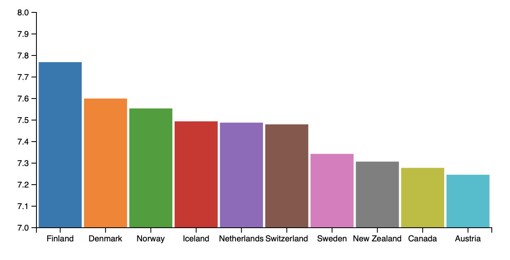

# ACS 4310 Final Assessment

Create a graph showing world happiness. Use `data/2019.csv`. This file has a list of about 150 countries. It provides data about each country.

- Country or region
- Freedom to make life choices
- GDP per capita
- Generosity
- Health and life expectancy
- Overall rank
- Perceptions of corruption
- Score 
- Social support

You need to graph the "Score" for the top 10 countries in the list. 

Your completed chart should look something like this: 

Follow the bar graph tutorial page as a guide. 

## Challenges:

### Challenge 1

Setup an HTML document with an SVG element. 

### Challenge 2

Import the D3 library and add a script tag for your code. 

### Challenge 3

Copy the `data/2019.csv` file into the directory where you are working. 

Add code to import the `2019.csv`. Log the results to the console to make sure things are working correctly. 

### Challenge 4 

You need to filter the top 10 happiest countries. Each country has an "Overall rank" property. You want the countries ranks 1 to 10. Looking at the data you'll see the countries are listed in ranked order so the first 10 items in the list would be the top 10 countries. 

Log these to the console. 

### Challenge 5 

Set up an x-scale. For a bar chart you can use `d3.scaleBand()`. 

The domain should the `Country or region` field. 

The range should be the width of your svg less the left and right margins. 

### Challenge 6

Set up a y-scale. This should use the `Score` field from the data. The `Score` shows the composite score that ranks and measure a countries happiness. 

You need to find the extent, the minimum and maximum values. 

As an added step round the minimum value down and the max value up to the nearest whole number. 

For example Finland has the highest Score of: 7.769. You should round this up to 8.0. Austria, the lowest of the top ten has a score of: 7.246. You should round this down to 7.0. 

### Challenge 7 

Draw the bars. Use D3 to draw some rectangles. You can follow the guide/tutorial from class. 

### Challenge 8 

Add a bottom axis. This should display the country names. 

### Challenge 9 

Add a left axis. This should display happiness score.

### Challenge 10 

Color the bars. Create a color scale using `d3.scaleOrdinal()`. The domain will be the country names. 

Make a list of 10 colors. This will be the range.

<!-- 

# FEW 2.5 Data Visualization Final Assessment

Your job is to present a report on world happiness. Use the data from the world happiness report on Kaggle: 

https://www.kaggle.com/unsdsn/world-happiness

I've downloaded the data and put it in the data folder. Be sure to take a look at the Kaggle page if you need more infromation about the data. 

Feel free to use D3, another library, or make everything up from scratch. 

## Challenges 

The goal of this assignment is to display the world happiness data. Beyond that the stretch goal is to reveal any connections between the data points. For example, try and answer these questions: 

- Are happy people more generous? 
- Is family or GDP a bigger influence on happiness? 
- Are free people healthier?
- Are countries that trust their government more productive? 

The data has 150+ countries you will only show the top 10 countries! 

This challenge is open ended you can develop your own solutions. That said try and use these following: 

- D3
- SVG
- scales 
- axis 

### Challenge 1

Make a web page to display your work. Imagine you'd be presenting your work when it is completed.

Display a heading at the top that says: 

"World Happiness Study"

In a subtitle include the class number and your name: 

"FEW 2.5 {name}"

### Challenge 2 

Import the data and display the following meta information on your page: 

- Year
- Name of study
- Number of countries in the study

### Challenge 3

Show the top ten countries in each of the categories below. You should display the name of the country with it's score. 

- "GDP per capita"
- "Social support"
- "Healthy life expectancy"
- "Generosity"

### Challenge 4 

To make this report really great you need to show some graphic data. I'll leave this up to you as to how you will display the information. The goal is to show how the top ten countries compare in the following areas. 

- "GDP per capita"
- "Social support"
- "Healthy life expectancy"
- "Generosity"

You can make four charts, combine this all into a single chart, or do something in between, like two charts each with two features. 

Combine any of the properties and features together to make an interesting visual. You can draw bars show numbers whatever you think will tell the story best. 

Try to make your visuals answer these questions: 

- Which countries are happiest
- How much happier is one countery vs the others

To solve a harder problem try to answer these questions:

- Are happy people more generous? 
- Is family or GDP a bigger influence on happiness? 
- Are free people healthier?
- Are countries that trust their government more productive? 

-----------------------

 -->

